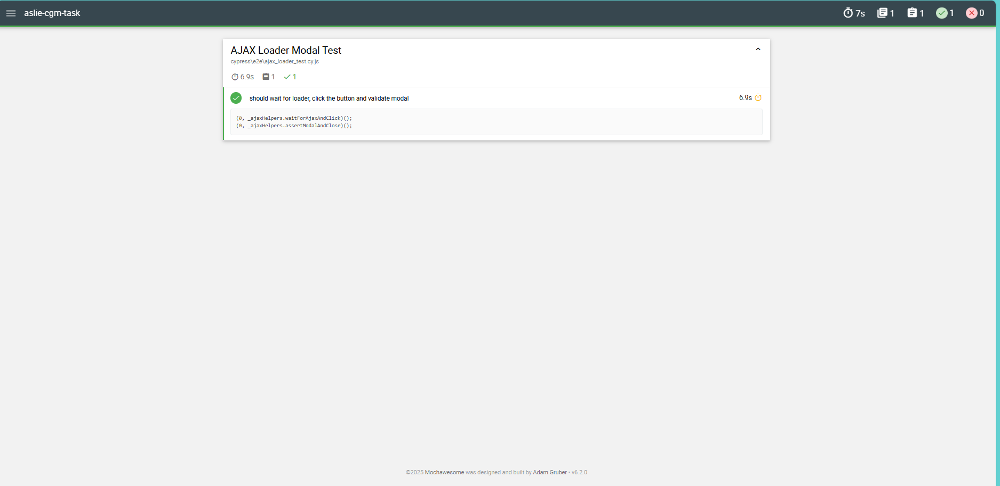
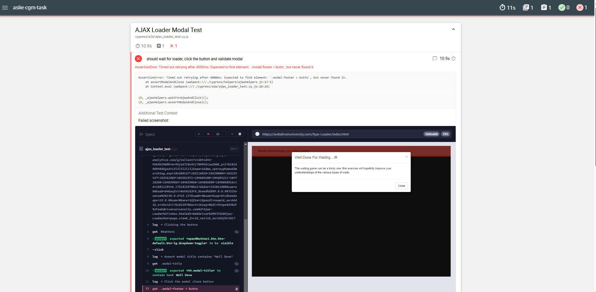

#  CGM Interview Task

This project contains two independent tasks:

1. ✅ **Cypress UI Automation** — AJAX Loader Modal Test  
2. ✅ **JavaScript Function** — AlphaOmega Number Evaluation

---

## Task 1: Cypress UI Test

Automated test on [Webdriver University - AJAX Loader](https://webdriveruniversity.com/Ajax-Loader/index.html).  
The test waits for the loader to disappear, clicks a button, and verifies that a modal appears and can be closed.

### Framework Features:
- Modular structure (locators, helpers, constants)
- Cypress Mochawesome reporting
- Video & screenshot capture on test failure

## 🛠️ Technologies & Tools

| Tool / Library                | Purpose                                 |
|------------------------------|-----------------------------------------|
| [**Cypress**](https://www.cypress.io/)           | End-to-end UI test automation          |
| [**Mochawesome**](https://www.npmjs.com/package/mochawesome)       | Advanced HTML test reporting           |
| [**Node.js**](https://nodejs.org/)              | JavaScript runtime                     |
| [**npm**](https://www.npmjs.com/)               | Dependency management                  |
| **VS Code** & **PowerShell** | Development and terminal environment   |

### Test Location:

```txt
cypress/e2e/ajax_loader_test.cy.js

## 📁 Project Structure

ASLIE-CGM-TASK/
├── alphaomega/                  → AlphaOmega logic task
│   └── alphaOmega.js
├── cypress/                    → Cypress testing framework setup
│   ├── e2e/                    → Main test file
│   │   └── ajax_loader_test.cy.js
│   ├── helpers/                → Reusable test functions
│   │   └── ajaxHelpers.js
│   ├── locators/              → Selectors for page elements
│   │   └── ajaxLocators.js
│   ├── constants/             → Test configs (timeouts, etc.)
│   │   └── testSettings.js
│   ├── support/               → Cypress hooks & config
│   │   ├── e2e.js
│   │   └── commands.js
│   └── reports/               → Cypress mochawesome HTML reports
│       └── mochawesome-report/index.html
├── cypress.config.js           → Cypress config file
├── package.json
└── README.md
```

---

## ⚙️ Installation

```bash
npm install
```

---

## ▶️ Run Tests

### Headless Mode

```bash
npx cypress run
```

### Interactive Mode (GUI)

```bash
npx cypress open
```

---

## 📊 Test Report (Mochawesome)

After running tests with `npx cypress run`, an HTML report will be generated at:

```txt
cypress/reports/mochawesome-report/index.html
```

To open it in your default browser:

```bash
start cypress/reports/mochawesome-report/index.html
```

### Example Report Outputs

## ✅ Passed Test

> Modal appears and is successfully closed.



---

## ❌  Failed Test with Screenshot and Video

> Mochawesome captures and displays rich debug info when a test fails:



---

> Preview of a test failure moment:


##  Task 2: AlphaOmega Function

A JavaScript function that returns a custom string based on number divisibility:

| Divisible by | Returns       |
|--------------|----------------|
| 3 only       | `Alpha`       |
| 5 only       | `Omega`       |
| 3 and 5      | `AlphaOmega`  |
| Neither      | `NoSymbol`    |

### File

```txt
alphaomega/alphaOmega.js
```

The script applies the logic to numbers from 1 to 100 and prints the output.

---

## Author

Aslie  
CGM Interview Task  
July 2025
