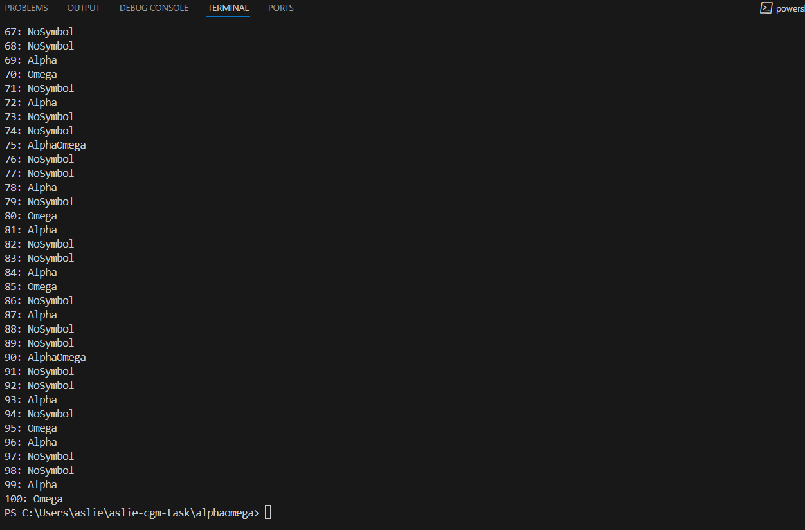

# CGM Interview Technical Task

## 1. AlphaOmega Function (JavaScript)

### Description

A simple function that accepts a number and returns a string based on divisibility rules:

- Returns `"Alpha"` if the number is divisible by **3**
- Returns `"Omega"` if the number is divisible by **5**
- Returns `"AlphaOmega"` if divisible by **both 3 and 5**
- Returns `"NoSymbol"` if divisible by neither



### Execution

To run this script:

```bash
cd alphaomega
node alphaOmega.js
